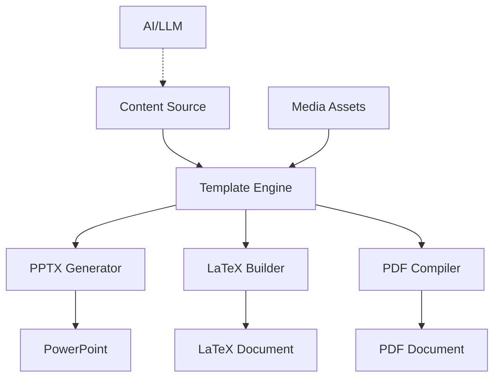

# Candia Doc Builder Core

> **Open-source core toolkit for producing polished documentation, specs, and presentations with AI assistance.** Transform ideas into client-ready material in minutes, not hours, and extend privately with your own business logic.

[](https://www.python.org/downloads/)
[](LICENSE)
[](https://github.com/alex-elia/candia-doc-builder-core)
[]()

**Stop spending hours on presentations. Generate professional decks, architecture docs, and pitch materials programmatically.**

## 🎯 The Problem

Creating professional documentation and presentations is time-consuming:
- **Manual work**: 4-8 hours per deck
- **Inconsistency**: Brand guidelines get missed
- **Repetition**: Same content, different formats
- **Scaling**: Can't generate 100 variations efficiently

## ✨ The Solution

Candia Doc Builder automates the entire workflow:
- ⚡ **Generate 50-slide decks in < 2 seconds**
- 🎨 **Template-driven**: Brand-compliant outputs every time
- 🔄 **Multi-format**: PPTX, PDF, LaTeX from one source
- 🤖 **AI-assisted**: Combine with LLMs for dynamic content

## 🚀 Features

### Core Capabilities (Open-Source)
- ✅ **PowerPoint Generation** - Programmatic PPTX creation with `python-pptx`
- ✅ **LaTeX/PDF Builders** - Professional pitch decks and architecture dossiers
- ✅ **Template System** - Reusable templates with placeholder support
- ✅ **Video Automation** - Generate demo videos and screen recordings
- ✅ **Multi-Platform** - Windows, macOS, Linux support
- ✅ **Extensible** - Plugin architecture for custom generators

### What Makes It Special
- 🎯 **Template-Driven Design** - Separate content from presentation
- 🔧 **Modular Architecture** - Mix and match components
- 📊 **Performance Optimized** - Batch generation for scale
- 🎨 **Brand Compliance** - Enforce style guides automatically

## 📊 Performance

| Metric | Manual | Candia Doc Builder | Improvement |
|--------|--------|-------------------|-------------|
| **Time per deck** | 4-8 hours | < 2 seconds | **99.99% faster** |
| **Consistency** | Variable | 100% | **Perfect** |
| **Batch generation** | Not feasible | 100+ decks/min | **Unlimited** |
| **Brand compliance** | Manual review | Automatic | **Zero errors** |

## 🎬 Showcase

### Example Outputs

**Architecture Presentations**
- System design blueprints
- Technical specifications
- Rollout plans

**Business Pitches**
- Investment decks
- Executive briefs
- Sales enablement materials

**Product Documentation**
- Feature specifications
- User guides
- API documentation

### Visual Examples

📸 **Screenshots and GIFs**: See [showcase/](showcase/) folder for visual demonstrations

🎯 **Working Examples**: See [examples/](examples/) for complete code examples

💡 **How to Add Showcase Content**: 
1. Generate your presentation
2. Take screenshots of key slides
3. Save to `showcase/screenshots/`
4. See [Showcase Workflow Guide](docs/guides/SHOWCASE_WORKFLOW.md) for details

*Example: Thales Alenia Space presentation (see `examples/satellite/`)*

## 🏗️ Architecture Overview



**Key Components:**
- **Template Engine**: Separates content from presentation
- **Generators**: Format-specific output modules
- **Media Pipeline**: Handles images, videos, assets
- **AI Integration**: Optional LLM assistance for dynamic content

## 🛠️ Tech Stack

| Category | Technologies |
|----------|-------------|
| **Core** | Python 3.11+, python-pptx, LaTeX |
| **Automation** | PowerShell, Bash, Python scripts |
| **Media** | FFMPEG, PIL/Pillow |
| **Templates** | PowerPoint (.pptx), LaTeX/Beamer |
| **Output** | PPTX, PDF, LaTeX, Markdown |

## 🚀 Quick Start

### Installation

```bash
# Clone the core repository
git clone https://github.com/alex-elia/candia-doc-builder-core.git
cd candia-doc-builder-core

# Create virtual environment
python -m venv .venv
. .venv/bin/activate  # Windows: .\.venv\Scripts\Activate.ps1

# Install dependencies
pip install -r requirements.txt
```

### Generate Your First Presentation

```bash
# Example: Generate architecture deck
python examples/satellite/generate_thales_presentation.py

# Example: Use custom template
python scripts/presentation/create_premium_template.py

# Example: Build LaTeX pitch
cd scripts/latex
./build_pitch.sh  # or build_pitch.ps1 on Windows
```

### Customize for Your Use Case

1. **Prepare your template** - See [docs/guides/TEMPLATE_PREPARATION_GUIDE.md](docs/guides/TEMPLATE_PREPARATION_GUIDE.md)
2. **Define your content** - JSON, YAML, or Python dicts
3. **Run the generator** - Point to your template and content
4. **Iterate** - Regenerate in seconds

## 🔁 Core + Bundle Strategy

This repository only ships **generic, reusable capabilities**. Use it as-is for open-source scenarios, or compose it inside a private bundle service when you need Elia Go–specific (or client-specific) workflows:

| Layer | Repository | Purpose |
|-------|------------|---------|
| **Core (OSS)** | `candia-doc-builder-core` | Template engine, generators, docs, Docker base image |
| **Bundle (Private)** | `candia-doc-builder` | Proprietary routes, business logic, secrets, deployment overlays |

Recommended wiring:

1. Keep this repo public.
2. Create a private repo that either consumes the published package or adds this repo as a Git submodule.
3. Extend via dependency injection (e.g., `StorageProvider`, `ReportWorkflow`) and enable features with env-driven toggles.
4. Build production images from the private bundle repo so proprietary code never ships with the open image.

See `docs/ARCHITECTURE.md` for the full blueprint.

## 📖 Use Cases

### Architecture & Design
- System architecture presentations
- Technical design documents
- Infrastructure rollout plans
- API documentation

### Business & Sales
- Investment pitch decks
- Executive briefings
- Sales enablement materials
- Product specifications

### Development & Engineering
- Feature specifications
- Technical proposals
- Code documentation
- Project roadmaps

## 📁 Repository Structure

```
candia-doc-builder-core/
├── README.md                 # This file
├── LICENSE                   # Apache 2.0
├── requirements.txt          # Python dependencies
│
├── docs/                     # Documentation
│   ├── README.md            # Documentation index
│   └── guides/              # How-to guides (12 guides)
│
├── scripts/                  # Automation scripts
│   ├── presentation/        # PPTX generators
│   ├── video/               # Video/demo scripts
│   └── latex/               # LaTeX/PDF builders
│
├── examples/                 # Complete examples
│   └── satellite/           # Satellite AI presentation example
│
├── Templates/                # PowerPoint templates
└── images/                   # Sample imagery
```

## 📚 Documentation

- **[Complete Documentation](docs/README.md)** - All guides and tutorials
- **[Dual-Repo Architecture](docs/ARCHITECTURE.md)** - How to combine core + private bundle
- **[Template Guide](docs/guides/TEMPLATE_PREPARATION_GUIDE.md)** - Creating templates
- **[Video Generation](docs/guides/VIDEO_DEMO_GENERATION_GUIDE.md)** - Demo videos
- **[Examples](examples/)** - Working code examples

## 🔧 Requirements

- **Python 3.11+**
- **LaTeX toolchain** (for PDF generation: TeX Live or MikTeX)
- **FFMPEG** (optional, for video helpers)

Install Python dependencies via `requirements.txt`. Templates use fonts commonly available on Windows/macOS.

## 🤝 Contributing

Contributions welcome! This project demonstrates:
- Clean Python architecture
- Template-driven design patterns
- Automation best practices
- Documentation workflows

See [docs/guides/](docs/guides/) for development guidelines.

## 🎯 Roadmap

- [ ] CLI interface for easier usage
- [ ] Containerized workflows (Docker)
- [ ] CI/CD for template validation
- [ ] Plugin system for custom generators
- [ ] Web UI for non-technical users

## 👤 Maintainer

**Alexandre GON**  
- 📧 Email: [alex.gon@eliago.com](mailto:alex.gon@eliago.com)  
- 💼 LinkedIn: [alex-gon-tech-ai-sustainability](https://www.linkedin.com/in/alex-gon-tech-ai-sustainability)

## 📄 License

Released under the [Apache License 2.0](LICENSE).

---

**Made in Candia 🇬🇷 (Heraklion) spirit—sun, sea, and fast execution.**

*Fork and adapt to your own AI documentation workflows. Showcase your technical expertise by building on this foundation.*
